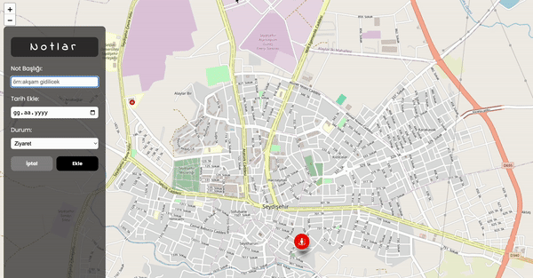

<h1>Note Map</h1>

"Note Map" projesi, kullanıcıların günlük aktivitelerini konum tabanlı olarak düzenlemelerine olanak tanıyan bir platformdur. Bu proje, kullanıcıların notlar ekleyebileceği, düzenleyebileceği, kişiselleştirebileceği ve harita üzerinde görsel olarak takip edebileceği bir deneyim sunmayı hedefler.

<h3>Ekran Görüntüsü</h3>

